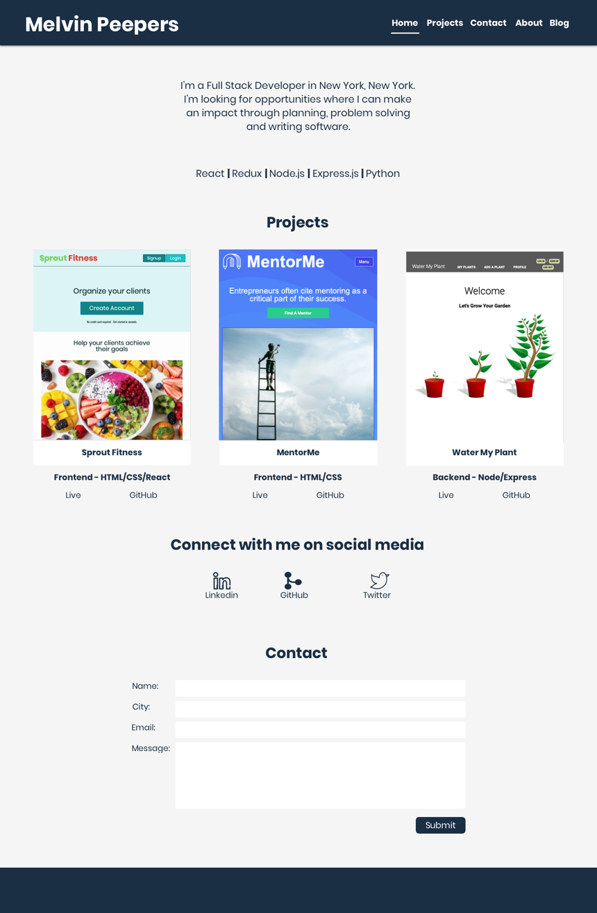

# Melvin's Portfolio

This is my portfolio to display my programming skills and projects I would like to highligh.

## Table of Contents

- [Screenshot](#screenshot)
- [Pitch](#skills)
- [Goal](#goal)
- [Getting Started](#getting-started)

## Screenshot

## Skills:

JavaScript
React
Redux
Node.js
Express.js
Python

## Goal:

1. To highlight the skills I have learned.
2. To display the projects I would like to highlight that I've worked on.

## Getting Started:

- For this repository to your local machine
- Open index.html
- All image assets are in the assets folder.
